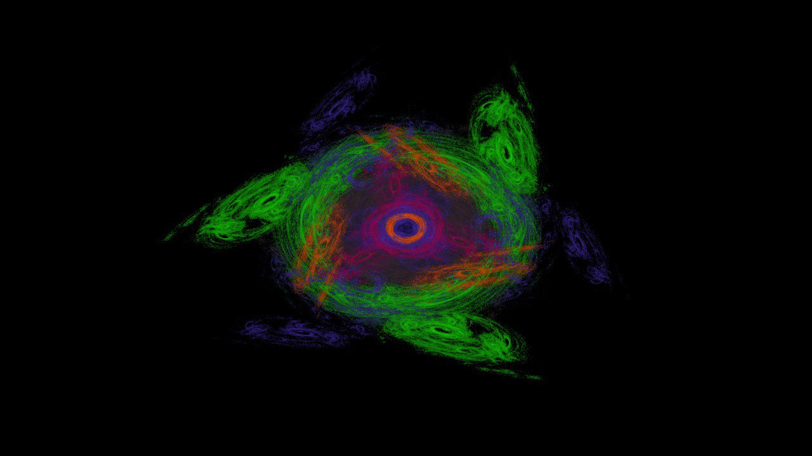
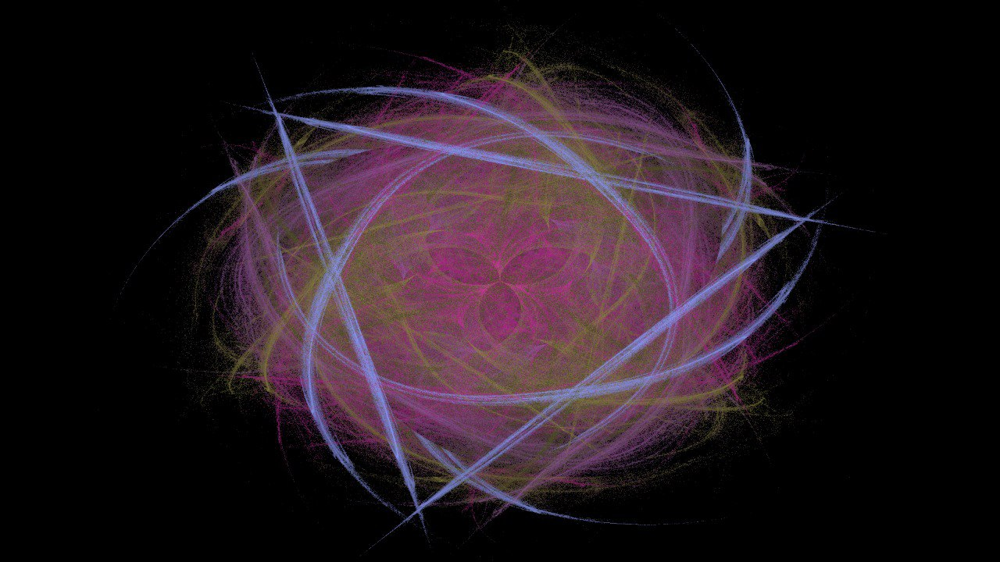
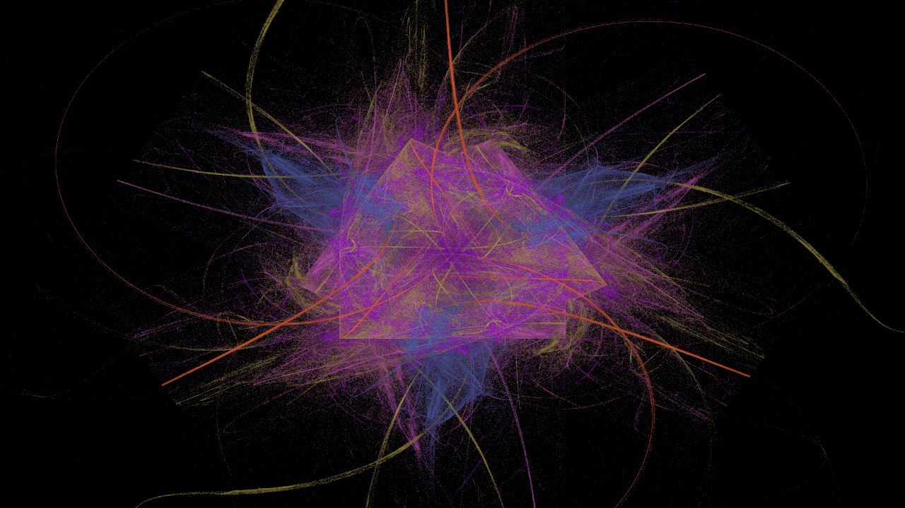

# Генератор фрактальных изображений

Данное приложение позволяет генерировать фрактальные изображения использую различные параметры генерации.

## Структура проекта

Проект состоит из следующих директорий и файлов:

- [pom.xml](./pom.xml) – дескриптор сборки, используемый maven, или Project
  Object Model. В нем описаны зависимости проекта и шаги по его сборке
- [src/](./src) – директория, которая содержит исходный код приложения и его
  тесты:
    - [src/main/](./src/main) – здесь находится код вашего приложения
    - [src/test/](./src/test) – здесь находятся тесты вашего приложения
- [mvnw](./mvnw) и [mvnw.cmd](./mvnw.cmd) – скрипты maven wrapper для Unix и
  Windows, которые позволяют запускать команды maven без локальной установки
- [checkstyle.xml](checkstyle.xml),
  [checkstyle-suppression.xml](checkstyle-suppression.xml), [pmd.xml](pmd.xml) и
  [spotbugs-excludes.xml](spotbugs-excludes.xml) – в проекте используются
  [линтеры](https://en.wikipedia.org/wiki/Lint_%28software%29) для контроля
  качества кода. Указанные файлы содержат правила для используемых линтеров
- [.mvn/](./.mvn) – служебная директория maven, содержащая конфигурационные
  параметры сборщика
- [lombok.config](lombok.config) – конфигурационный файл
  [Lombok](https://projectlombok.org/), библиотеки помогающей избежать рутинного
  написания шаблонного кода
- [.editorconfig](.editorconfig) – файл с описанием настроек форматирования кода
- [.github/workflows/build.yml](.github/workflows/build.yml) – файл с описанием
  шагов сборки проекта в среде Github
- [.gitattributes](.gitattributes), [.gitignore](.gitignore) – служебные файлы
  для git, с описанием того, как обрабатывать различные файлы, и какие из них
  игнорировать

## Сборка проекта

Для того чтобы запустить проект на Windows:

```shell
./mvnw compile
./mvnw exec:java -Dexec.mainClass="backend.academy.Main"
```

Для того чтобы запустить проект на Linux:

```shell
./mvn compile
./mvn exec:java -Dexec.mainClass="backend.academy.Main"
```

## Примеры




